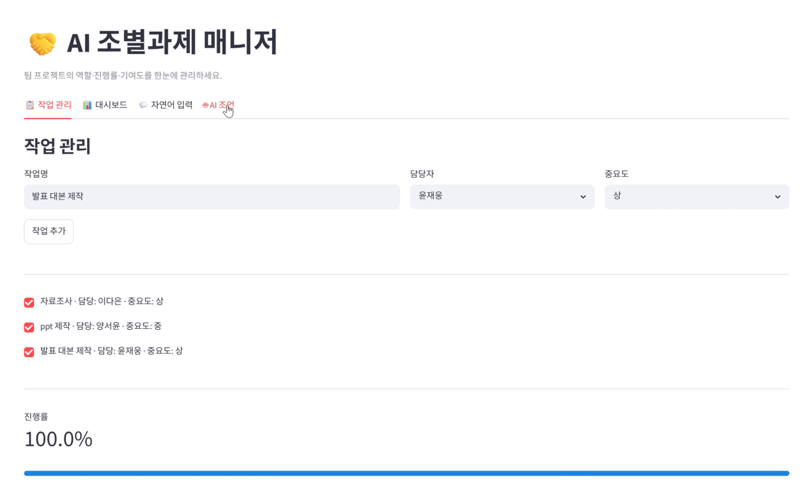
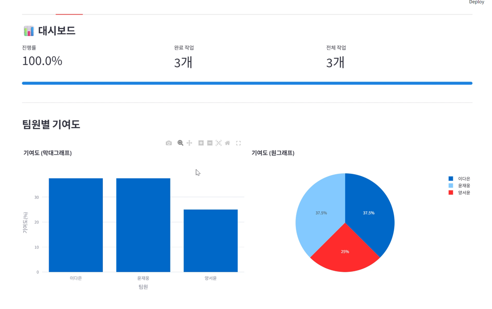
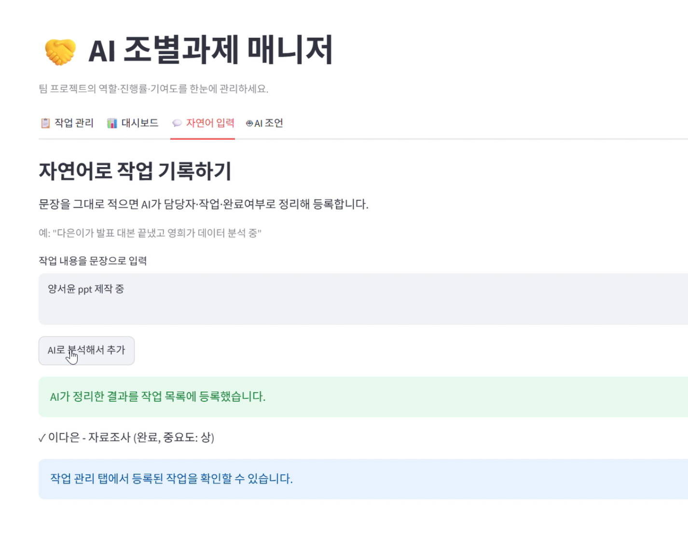
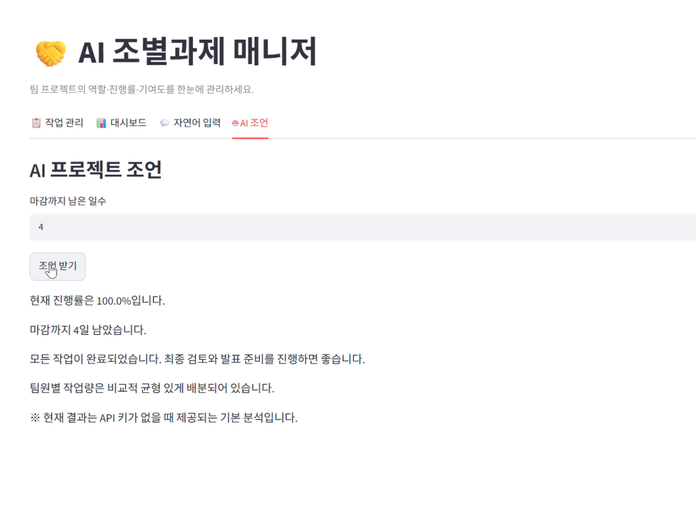

# AI 조별과제 매니저 (TeamMate AI)

> 팀 프로젝트의 역할 분배 · 진행률 · 기여도를 한눈에 관리하고,
> AI가 자연어 입력을 작업으로 정리하고 진행 상황을 분석해 조언해 주는 웹 서비스.

## 한 줄 소개

조별과제 진행 과정에서 작업 분담, 진행률, 기여도를 쉽게 관리할 수 있도록 제작한 웹 서비스입니다.

## 주요 기능

| 기능 | 설명 |
|------|------|
| 팀원 등록 | 팀원 이름을 추가해 목록으로 관리 |
| 작업 등록 / 완료 | 작업명·담당자·중요도를 입력하고 완료 여부 체크 |
| 진행률 계산 | 전체 작업 중 완료 비율(%)을 자동 표시 |
| 기여도 시각화 | 완료 작업의 중요도 가중치로 팀원별 기여도를 막대/원 그래프로 표시 |
| **자연어 입력 (AI)** | "다은이가 발표 대본 끝냄" 같은 문장을 AI가 담당자·작업·완료여부로 자동 정리 |
| **AI 프로젝트 조언** | 현재 상황을 AI가 분석해 우선순위·역할 재분배를 제안 |

> 자연어 입력 기능과 AI 조언 기능을 통해 기존 할 일 관리 앱과 차별화를 시도하였습니다.

## 실제 실행 화면

<!-- 아래 자리에 스크린샷 또는 1분 미만 GIF/동영상 링크를 넣으세요.
     (이미지 파일은 레포지토리의 /screenshots 폴더에 올린 뒤 경로를 적으면 됩니다) -->

**① 작업 관리 화면**

**② 대시보드 (진행률 · 기여도 그래프)**

**③ 자연어 입력 → AI 자동 정리**

**④ AI 프로젝트 조언**

**실행 영상(1분 미만):** [여기에 GIF 또는 동영상 링크]

---

## 팀원별 역할 및 기여도

| 팀원 | 담당 파일 / 역할 |
|------|------------------|
| **이다은** | 전체 구조 설계, `models.py`, `ai_features.py`, `app.py`, GitHub 저장소 관리, 프롬프트 기록 정리 |
| **양서윤** | `sections.py`(작업 등록·완료 화면 + 대시보드 지표), `README.md` 작성 |
| **윤재웅** | `charts.py`(기여도 그래프) + `advice.py`(AI 조언 화면), 실행 GIF/영상 제작 |

## 참고 자료
주요 프롬프트와 활용 내용은 `prompts/prompt_log.md`에 정리하였다.